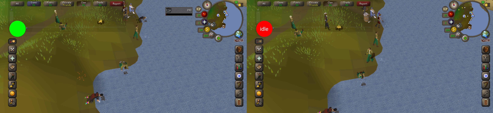

# MORS
Android Open Source Old School RuneScape Helper

This is not a client, it draws on top of the original OSRS client.

Only works for Android 

Your device needs to be rooted to use this application.

The reason it must be rooted is because we are using Frida.js to instrument the client. Therefore you will need to download the [frida-inject 14.0.8](https://github.com/frida/frida/releases/tag/14.0.8) application's and put it under /data/local/tmp/ on your phone filesystem

# Whats working?
* At the moment only idle notifier: Shows a draggable colored circle overlay on top of the game. Green when performing an animation, red when idle

# Whats new?
* The Client has been de-obfuscated and mapped to an API in the JavaScript language recognized by Frida.js. These APIs can be used to develop new plugins and simplify communication with the Client. For de-obfuscation, the desktop client code was mapped to the mobile client code and this raised some problems:
  * Not all classes and methods have been mapped.
  * The identifiers for the animations (and possibly others as well) are different than in the desktop version and must be remapped.
  * If you want to use the API you need to compile the scripts with [frida-compile](https://github.com/frida/frida/releases/tag/14.0.8)

# How to use
* [Complete the first time setup]
    * [Root phone](https://www.xda-developers.com/root/).
    > PLEASE NOTE: Rooting a device may void the warranty on the device. It may also make the device unstable or if not done properly, may completely brick the device. Some methods may install additional apps/software on your device. Developers or the author does not take any responsibility for your device. Root at your own risk and only if you understand what you are doing!
    * Add frida-server:
        * Download the [frida-server](https://github.com/frida/frida/releases/tag/14.0.8) 14.0.8
        * Download the [frida-inject](https://github.com/frida/frida/releases/tag/14.0.8) 14.0.8
        * [Download and install [Android Debug Bridge (adb)](https://developer.android.com/studio/command-line/adb)]
        * Move both frida-server and frida-inject in /etc/local/tmp/ on your phone filesystem
            * if you downloaded adb open a terminal on your computer and write:
                * `adb push frida-server /etc/local/tmp/` press enter 
                * `adb push frida-inject /etc/local/tmp/` press enter 
            * Otherwise download frida-server and frida-inject on your device as well as a terminal emulator app (for example [termux](https://play.google.com/store/apps/details?id=com.termux))
                * Open the downloaded terminal app and write
                    * `cp /download/directory/.../frida-server /etc/local/tmp/` press enter
                    * `cp /download/directory/.../frida-inject /etc/local/tmp/` press enter
        * [If you want to edit the app to add plugins you may want to download also [Android Studio](https://developer.android.com/studio) and [frida-compile](https://github.com/frida/frida-compile)]
* Download and install [mors.apk](mors.apk)
    * If you dont want to develop, just download the apk file in this repository and install it. Warning: this is an unsigned debug apk, it may asks you to [acquire developer role](https://www.howtogeek.com/129728/how-to-access-the-developer-options-menu-and-enable-usb-debugging-on-android-4.2/). Install at your own risk.
        * If you installed adb open a terminal on your computer and write: adb install mors.apk
        * Otherwise download the apk directly to your phone and install it from there.
    * On android studio simply run the application to any connected device
* Open client and log in
    * The client must be already open when you start any plugin
* Open the app.
* All the plugins are in javascript (you can test idlenotifier_compiled.js)
    * Hold the plugin name to start the script
* Once a plugin is running you can switch back to client and play.

# TO-DOs
* Map AnimationID
* Check if other IDs changed
* The client application should be futher de-obfuscated
* Add both deobfuscator and javascript injector to this repository
* API Documentation
* Other plugins

# Contributing
* Make a fork
* Test all changes before submitting
* Submit a pull request with details on the changes and why it should be submitted.
* By submitting you are agreeing that you are legally allowed to contribute the code provided and are not under any arbitration agreements.

All images used are copyright of their respective owners.
Runescape related images are copyright of Jagex Ltd.
